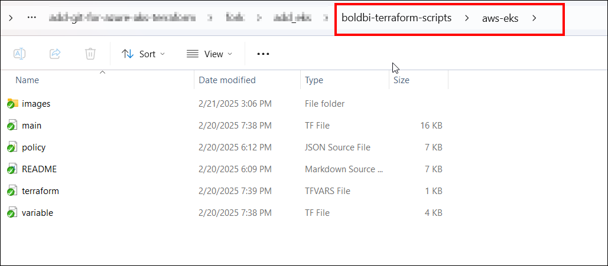
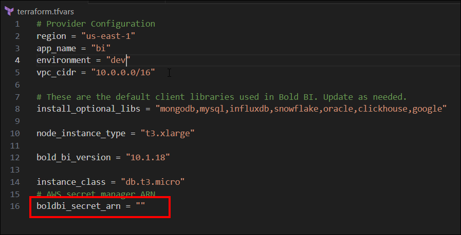
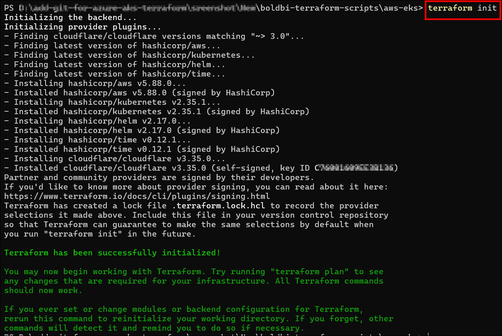
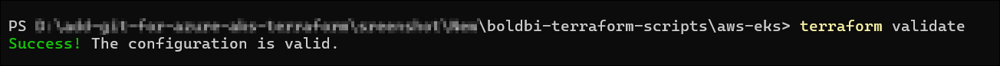

# Deploy Bold BI Using Terraform on AWS EKS

This guide explains how to deploy Bold BI using a Terraform script. The script automates the creation of all necessary AWS resources and the deployment of Bold BI. Once the deployment is complete, you can copy and paste the APP_URL into your browser to start evaluating Bold BI.

---

## Prerequisites

Before proceeding, ensure the following tools and resources are installed and available:

1. **Terraform CLI**  
   Install Terraform from the official guide: [Terraform Installation Guide](https://developer.hashicorp.com/terraform/tutorials/aws-get-started/install-cli)
2. **AWS Account with Required Privileges**  
   Ensure your AWS account has the necessary permissions defined in the [Policy.json](./policy.json) file.

---

## Compatibility

### Tested Platforms and Versions

Bold BI Terraform EKS deployments have been tested and validated with the following component and provider versions:

| **Component**               | **Version(s)**    | **Description**                                     | **Status**   |
|-----------------------------|-------------------|-----------------------------------------------------|--------------|
| **Terraform CLI**           | 1.10.5, 1.12.2    | Infrastructure as Code engine for all provisioning  | ✅ Tested    |
| **AWS Provider**            | 6.9.0             | AWS infrastructure provisioning (VPC, EKS, RDS, etc.) | ✅ Tested    |
| **Kubernetes Provider**     | 2.38.0            | Kubernetes resource integration                     | ✅ Tested    |
| **Helm Provider**           | 3.0.2             | Helm chart deployment into Kubernetes               | ✅ Tested    |
| **Cloudflare Provider**     | 3.35.0            | DNS/Cloudflare integration (optional, if using)     | ✅ Tested    |
| **Time Provider**           | 0.13.1            | Utility provider for timeouts and waits             | ✅ Tested    |

---

### BoldBI Kubernetes Compatibility

| **BoldBI Version** | **Kubernetes Supported Versions** | **ingress-nginx Tested Versions** | **Tested Environments** | **Release Date** |
|--------------------|-----------------------------------|-----------------------------------|------------------------|------------------|
| Latest (13.1.10)    | 1.32.x, 1.31.x, 1.30.x            | 4.0.10                  | EKS 1.32     | 2025-07-15       |

---

## Overview of the Script

The Terraform script creates the following resources:

- **Application Load Balancer**
- **EKS Cluster**
- **EFS Storage**
- **RDS PostgreSQL Server**
- **Security Group, VPC, Internet Gateway, and Route Table**
- **Domain Mapping Entry** on Route 53

---

## Deployment Steps

### Step 1: Clone the Terraform Scripts Repository

Clone the Terraform scripts repository using the following command:

```sh
 git clone https://github.com/boldbi/boldbi-terraform-scripts.git
```

### Step 2: Navigate to the Terraform Scripts Directory

```sh
cd boldbi-terraform-scripts/aws-eks
```



### Step 3: Set Environment Variables

To authenticate Terraform with your AWS account, add the following environment variables to your [local system](https://chlee.co/how-to-setup-environment-variables-for-windows-mac-and-linux/) variables. Alternatively, you can log in using [aws configure](https://docs.aws.amazon.com/cli/v1/userguide/cli-chap-configure.html)

| **Variable Name**             | Required | **Description**                                    |
|-------------------------------|----------|----------------------------------------------------|
| AWS_ACCESS_KEY_ID             | Yes      | AWS access key for authentication                 |
| AWS_SECRET_ACCESS_KEY         | Yes      | AWS secret key for authentication                 |

Other than this, we need to add the following environment variables either as a [local system](https://chlee.co/how-to-setup-environment-variables-for-windows-mac-and-linux/) variable or in [AWS Secrets Manager](https://docs.aws.amazon.com/secretsmanager/latest/userguide/create_secret.html) as shown below:

| system variable               |AWS Secrets Manager Variable Name |Required| **Description**                                    |
|-------------------------------|----------------------------------|--------|----------------------------------------------------|
| TF_VAR_db_username            | db_username              | Yes    | **Database username** <br> - db username must only contain characters and numbers.<br> - db username cannot be 'admin', 'administrator', 'root', 'guest', 'public' or start with 'pg_'.                             |
| TF_VAR_db_password            | db_password              | Yes    | **Database password** <br> - Your password must be at least 8 characters and at most 128 characters.<br> - Your password must contain characters from three of the following categories<br> - English uppercase letters, English lowercase letters, numbers (0-9), and non-alphanumeric characters (!, $, #, %, etc.).<br> - Your password cannot contain all or part of the login name. Part of a login name is defined as three or more consecutive alphanumeric characters.                                 |
| TF_VAR_boldbi_email           | boldbi_email                     | Yes     | Bold BI admin Email                           |
| TF_VAR_boldbi_password        | boldbi_password                  | Yes     | **Bold BI admin password**<br> - Your password must be at least 8 characters and at most 128 characters.<br> - Your password must contain characters from three of the following categories<br> - English uppercase letters, English lowercase letters, numbers (0-9), and non-alphanumeric characters (!, $, #, %, etc.)|
| TF_VAR_boldbi_unlock_key      | boldbi_unlock_key                | Yes     | Unlock key for Bold BI                           |
| TF_VAR_route53_zone_id        | route53_zone_id                  | No      | AWS Route 53 Zone ID (if applicable)             |
| TF_VAR_app_base_url           | app_base_url                     | No      | Base URL for the Application                     |
| TF_VAR_cloudflare_api_token   | cloudflare_api_token             | No     | Cloudflare API Token for DNS mapping on cloudflare|
| TF_VAR_cloudflare_zone_id     | cloudflare_zone_id               | No     | Cloudflare zone ID for DNS mapping on cloudflare  |
| TF_VAR_tls_certificate_path   | tls_certificate_path             | No      | For apply SSL creatificate on EKS cluster <br>Example <br>**windows**<br>D:\\\SSL\\\test\\\domain.crt<br>**Linux**<br>/home/adminuser/ssl/test/domain.crt        | 
| TF_VAR_tls_key_path           | tls_key_path                     | No      | For apply SSL private key on EKS cluster <br>Example <br>**windows**<br>D:\\\SSL\\\test\\\domain.key<br>**Linux**<br>/home/adminuser/ssl/test/domain.key         |


Application Variables after setting in system variables:


Application Variables after setting in AWS Secrets Manager:


**Note:**

- If you are using AWS Secrets Manager, you need to specify the AWS secret ARN in the `terraform.tfvars` file as shown below.



- If you need to change any infrastructure or application-level settings, refer to the `terraform.tfvars` file.

- If you do not set the secrets in either location, Terraform will prompt you for the values during execution.

### Step 4: Initialize Terraform

Open PowerShell or Terminal from the `boldbi-terraform-scripts/aws-EKS` directory and run the following command:

```sh
terraform init
```



### Step 5: Validate the Terraform Script

Run the following command to validate the script before applying:

```sh
terraform validate
```



### Step 6: Apply the Terraform Script

Execute the following command to apply the Terraform script. When prompted, type "yes" to approve the resource creation.

```sh
terraform apply
```


After seeing the following message, you can access Bold BI in your browser:


Please wait until the startup process completes and avoid opening the URL in multiple tabs. The initial startup may take some time. Once the startup configuration is complete, Bold BI will be ready for use.


## Destroy Bold BI and Resources

To destroy Bold BI and all associated resources, run the following command from the same directory. When prompted, type "yes" to confirm the deletion.

```sh
terraform destroy
```


---

### **Tagging for Resource Grouping, Monitoring, and Cost Management**

All AWS resources created by this Terraform script are tagged identically using:

- **Key:** `Name`
- **Value pattern:**  
  `terraform-<app_name>-<environment>`  
  _Example_: `terraform-boldbi-dev`

**This enables:**

- Grouping, filtering, and cost allocation in the AWS Console, CLI, and Cost Explorer.
- Fast resource identification for operations and cleanup.

**Note:** If you planned to modify tag name please update your values on `common_name` on main.tf file.
